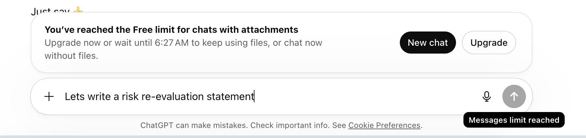
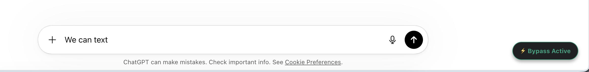

# ChatGPT Limit Bypass

Client-side UI bypass (well known). I did not find this, but I made this extension to make it easier to continue the chat when the button is disabled.

If you get the message:
> "You’ve reached the Free limit for chats with attachments
> Upgrade now or wait until 6:27 AM to keep using files, or chat now without files."

Simply load this extension in your browser!

### Loading Steps:
1. Download all the files and put them into a single folder.
2. Open Chrome and go to `chrome://extensions/`.
3. Turn on **Developer mode** in the top right corner.
4. Click **Load unpacked** in the top left.
5. Select the folder where you saved the files.

Enjoy till it lasts..

*Fully vibe-coded extension with Google Gemini. No data collection.*
